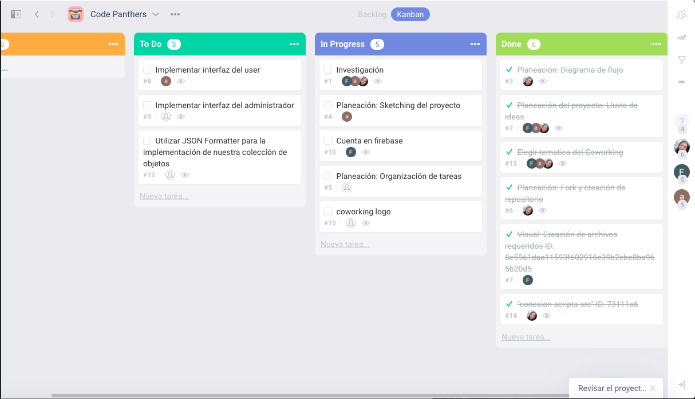
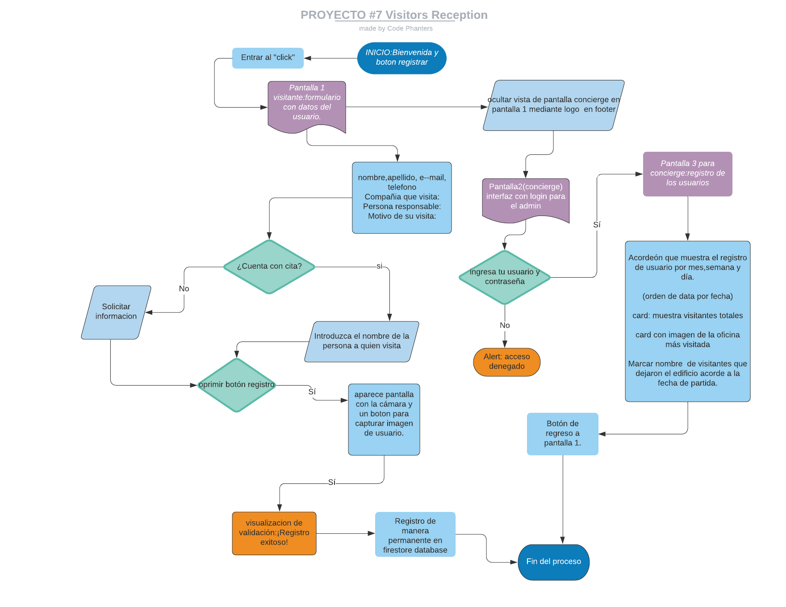

# 07_Visitors_Reception

Aplicación construida con JavaScript, HTML, CSS y Firebase cuyo objetivo es registrar a los visitantes de un Coworking.
La app cuenta con dos interfaces una para que el usuario acceda al inmueble y otra para que los administradores del coworking lleven un control de entradas y salidas de los visitantes.


Loop Work.Co es un coworking internacional que esta en expansión que cuenta con 16 oficinas,recién llegó a la CDMX en la zona de Polanco. Debido a las medidas sanitarias por el SARS COV-2, se mantiene un protocolo sanitario a la entrada del edificio. Sin embargo el acceso debe ser más ágil,seguro y practico para el ususario; además se debe guardar un registro

---

Índice

     1.- Mostrar una vista privada con contraseña ac Descripción
     2. Definición de usuario e historias de usuario (UX)
     3. Criterios de aceptación
     4. Requisitos técnicos
     5. Edición hacker
     6. Resultados de aprendizaje previstos

---

## 1. Descripción

Aplicación web para tableta para registro digital de visitantes en la entrada de un edificio de coworking de 8 pisos, cada piso con 2 oficinas, cada oficina tiene al menos un trabajador base. La aplicación web también tiene una vista de administrador privada, para ver los registros actuales del día y los números importantes como cuántos registros durante el mes, la semana y el día. También las oficinas con más visitantes y la lista completa de visitantes totales.

## 2. Definición de usuario:

** Usuario 1: Visitantes del edificio de coworking **

** Usuario 2: administradores de recepción del edificio de coworking, conserje **

## Historias de usuario:

La interfaz debe permitir a los visitantes:

- Para tocar o hacer clic para registrarse
- Nombre y apellido
- Correo electrónico o número de teléfono
- Empresa u oficina que visita
- Personas que visitan
- Razón para visitar
- Si ya tenía cita o necesita notificar a la oficina que visita
- Después de que se capturaron estos datos, podrá tomar una foto del rostro del visitante.
- Almacene todo el registro y confirme que el registro se ha realizado correctamente y se permite la entrada al visitante.

La interfaz para los administradores de trabajo conjunto (no debe ser visible como primera vista para los visitantes):

- Mostrar una vista privada con contraseña de acceso
- Mostrar la lista de visitantes completa ordenados por fecha de registro
- Muestra cuántos visitantes se han registrado hasta ahora.
- Muestra cuántos visitantes se han registrado durante los últimos 30 días.
- Muestra cuántos visitantes se han registrado durante la última semana (7 días)
- Muestra cuántos visitantes se han registrado durante el día.
- Poder añadir una marca de los visitantes que han abandonado el edificio como "Fecha de salida" y la fecha de salida.

## Proceso de flujo de trabajo

Se utiliza el método agile para distribuir las tareas del proyecto



---

## 3. UI(user interface)

### Maquetación

---

## Diagrama de flujo



## 3. Criterios de aceptación

- Poder correr la app desde diferentes tamaños de pantalla: móviles, tabletas, ordenadores de sobremesa
- Realizar pruebas unitarias para "funciones puras"
- Cubre todas las Historias de Usuario.

The _boilerplate_ should contains a file structure as a starting point like thisas all the sample dependencies and tests configuration:

```text
./
├── .editorconfig
├── .eslintrc
├── .gitignore
├── README.md
├── package.json
├── assets
├── src
│   ├── app.js
│   ├── data.js
│   ├── index.html
│   ├── index.js
│   └── style.css
└── test
    ├── app.spec.js
    └── index.html
```

---

## 5. Hacker Edition

---

You are not limited to implementing only the mandatory part, you can go forward implementing this functionalities:

- The visitors can re-shoot the photo if they do not like it.
- The administrators can see the picture of the visitors as well on the lists.

---

## 6. Expected Learning Outcomes

---

- [ ] npm init
- [ ] JSON
- [ ] ASYNC AWAIT
- [ ] DB Firestore
- [ ] My first CRUD in Firebase
- [ ] My first Data Structuring project
- [ ] Access to Operative System feature: camera
- [ ] Array methods and iterators
- [ ] object iterators and key finders
- [ ] import & export modules
- [ ] GitHub Branch Modeling > Development > Release
- [ ]

---

# ReadMe
